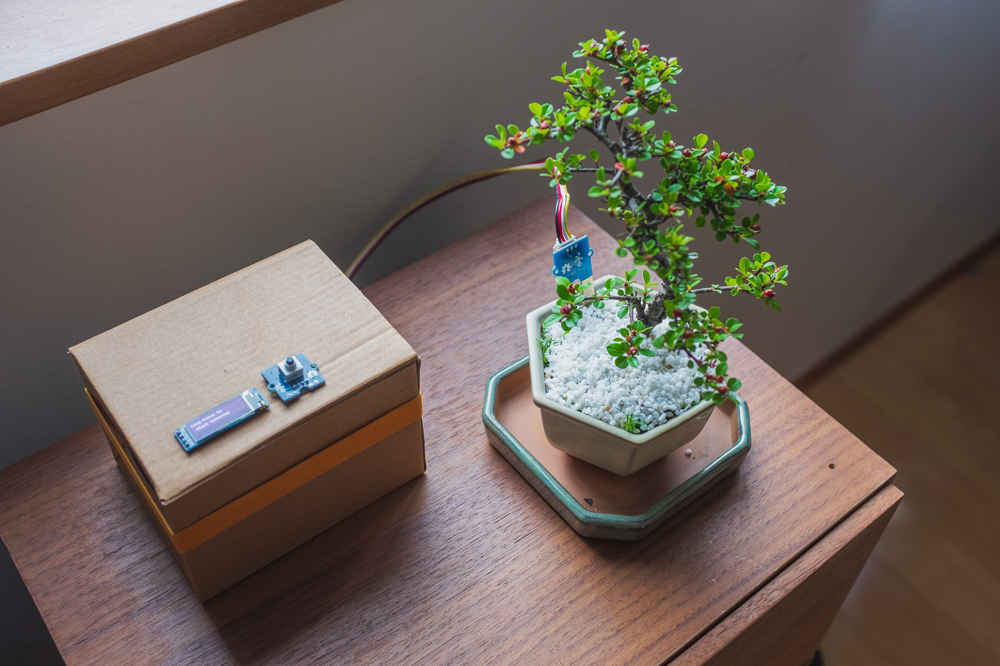

# raspi-plant

Automatic watering and monitoring system for plants

- 128x32 Multi-purpose Display
    - Sensor Mode
        - Soil Moisture
        - Temperature and Humidity (not implemented yet)
        - UV (not implemented yet)
    - Computer Resources Mode
        - CPU Usage and Temperature
        - Memory Usage
    - Manual Watering Mode
- Web Dashboard (not implemented yet)
- Scheduled Watering (not implemented yet)
